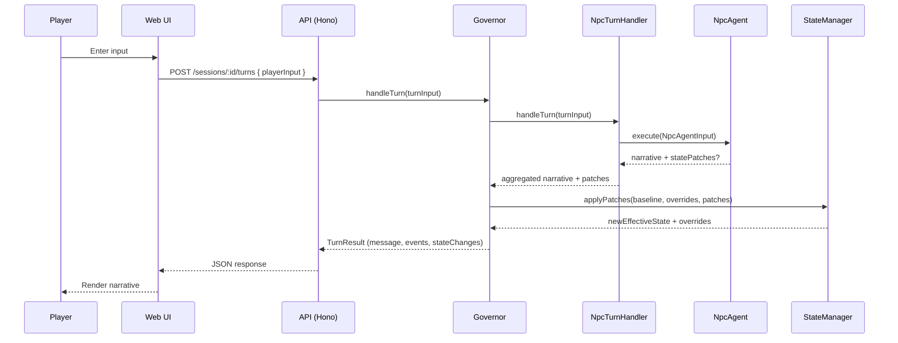
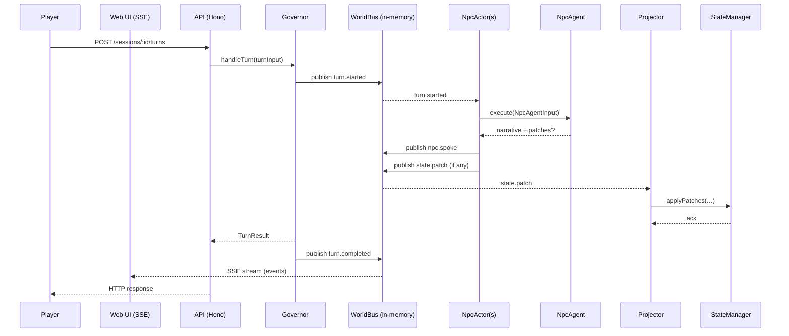
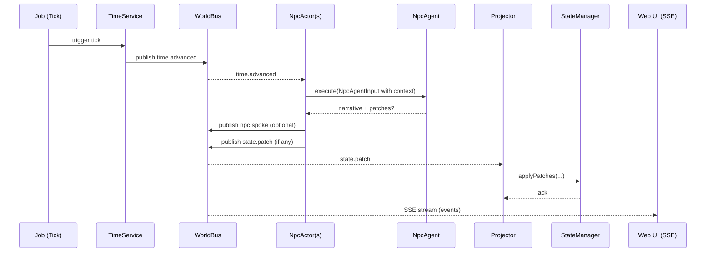

# World Bus vs Governor — Addendum: Sequence Diagrams and PoC Plan

Created: January 2026

This addendum extends dev-docs/world-bus-vs-governor.md with sequence diagrams and a PoC task list. It assumes the main document’s sections 1–9. Numbering continues below.

---

## 10) Sequence Diagrams

### 10.1 Governor-only Turn Flow (today)

### 10.2 Hybrid: World Bus Overlay on Turn

### 10.3 Simulation Tick (no player input)

---

## 11) PoC: Minimal World Bus + Actor Pilot Task List

### 11.1 Phase A — Event Overlay (1–2 days)
- Define WorldEvent types: `turn.started`, `turn.completed`, `npc.spoke`, `state.patch`, `time.advanced`.
- Implement in-memory WorldBus: `publish/subscribe` with filter predicate (best-effort).
- Bridge Governor: Wrap `Governor.handleTurn` to publish lifecycle and `state.patch` events.

### 11.2 Phase B — Streaming & Dev UX (1–2 days)
- API SSE endpoint: `GET /sessions/:id/events` streaming WorldBus events for the session.
- Web Dev Panel: Minimal client to render event feed (type, timestamp, payload summary).
- Toggle: `WORLD_BUS_ENABLED=true` in config.

### 11.3 Phase C — Projectors (2–3 days)
- Projector module: Subscribe to `state.patch`, call `StateManager.applyPatches(...)` with current baseline/overrides.
- Tests: Unit tests for projector (applies patches, idempotent behavior).
- Optional persistence: Append events to a table for replay in dev.

### 11.4 Phase D — NpcActor Pilot (3–4 days)
- NpcActor wrapper: Subscribe to `turn.started` and `time.advanced`, build `NpcAgentInput`, call `NpcAgent.execute`.
- Small NPC cohort: Enable only for 1–3 major NPCs; others remain in `NpcTurnHandler`.
- Publish outputs: Emit `npc.spoke` and `state.patch` from actors.

### 11.5 Phase E — Validation & Observability (2–3 days)
- Comparative tests: Same prompts through old vs hybrid path, compare narratives and state deltas.
- Tracing: Span events around publish/subscribe and actor execution.
- Load check: Ensure bus/actors do not regress p95 turn latency.

### 11.6 Phase F — Rollout & Safety (1–2 days)
- Feature flags: Per-session flag to enable actor pilot.
- Fail-closed: If actor errors, revert to `NpcTurnHandler` for that turn.
- Docs: ADR + dev-doc updates; how to subscribe to bus, add projectors, and build actors.

### 11.7 Acceptance Criteria
- SSE stream displays turn lifecycle and at least one `npc.spoke` and `state.patch` during a test session.
- Projector applies patches identically to Governor-applied patches (no schema violations).
- Actor pilot NPC produces narrative at least as frequently as baseline path with no error burst and <10% latency overhead.

### 11.8 Out of Scope (PoC)
- Durable transport (Redis/Kafka), full event sourcing, cross-session projections, multiplayer protocols.
